# Challenge 01: Continuous Integration and Deployment for Contoso Traders using GitHub Actions

## Introduction
This challenge is designed to evaluate the attendee/user skills in creating a robust CI/CD pipeline leveraging GitHub Actions. It aims to assess your capability to not only establish a seamless pipeline but also to guarantee the successful deployment of the application. Through this challenge, the attendee/user will set up a GitHub repository, implement a CI/CD workflow using GitHub Actions, deploy a .NET application to Azure, and make rolling updates to the application.

Here's the solution guide, which includes detailed step-by-step instructions required to complete the challenge.

## Accessing GitHub

1. To access and log into GitHub, open the edge browser from inside the environment and navigate to **[GitHub](https://github.com/)**.

2. Sign in to GitHub by clicking on the **Sign in** button in the top right corner of the GitHub home page.

3. On the **Sign into GitHub tab**, you will see a login screen. Enter the following email/username, and then click on **Next**.

   - **Email/Username:** <inject key="GitHubUsername"></inject>

1. Now enter the following password and click on **Sign in**.

   - **Password:** <inject key="GitHubPassword"></inject>

## Accessing the Azure Portal

1. To access the Azure Portal, open the Edge browser from inside the environment and navigate to the **[Azure Portal](https://portal.azure.com)**.

1. On the **Sign in to Microsoft Azure** tab, you will see a login screen. Enter the following email/username, and then click on **Next**. 
   * **Email/Username**: <inject key="AzureAdUserEmail"></inject>
        
1. Now enter the following password and click on **Sign in**.
   * **Password**: <inject key="AzureAdUserPassword"></inject>
     
1. If you see the pop-up **Stay Signed in?**, click No.

1. If you see the pop-up **You have free Azure Advisor recommendations!**, close the window to continue the lab.

1. If a **Welcome to Microsoft Azure** pop-up window appears, click **Cancel** to skip the tour.

## Solution Guide 

### Task 1: Setup a GitHub repository

In this task, you will login to an account on [GitHub](https://github.com) and use `git` to add lab files to a new repository.


1. In the LABVM desktop, open the **Microsoft Edge** browser.

   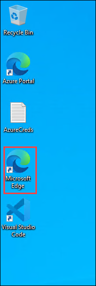

   >**Note**: If you see any open PowerShell prompts running, please minimize them and proceed with the next steps.

   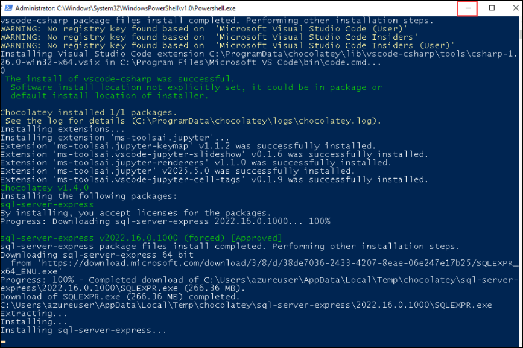

1. In a new tab, navigate to the **GitHub login** page by copying and pasting the following URL into the address bar:

   ```
   https://github.com/login
   ```

1. On the **Sign in to GitHub** tab, enter the provided **GitHub username** **(1)** in the input field, and click on **Sign in with your identity provider** to continue **(2)**.

    - Email/Username: <inject key="GitHub User Name" enableCopy="true"/>`

      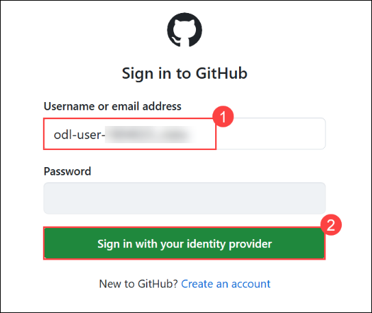

1. Click on **Continue** on the **Single sign-on to CloudLabs Organizations** page to proceed.

    

1. You'll see the **Sign in** tab. Here, enter your Azure Entra credentials:

   - **Email/Username:** <inject key="AzureAdUserEmail"></inject>

       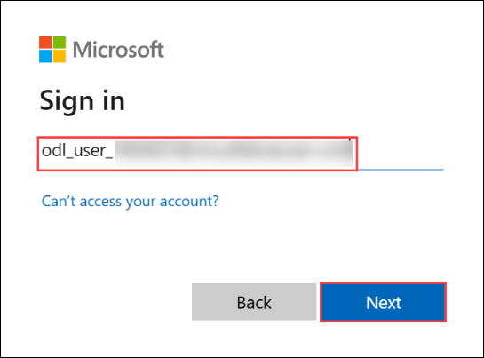

1. Next, provide your password and click on **Sign in**

   - **Password:** <inject key="AzureAdUserPassword"></inject>

      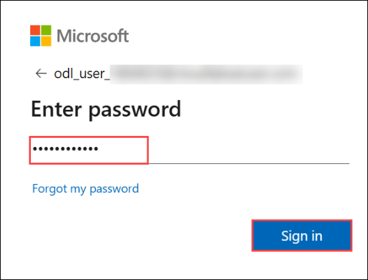

1. On the **Stay Signed in?** pop-up, click on No.

    

1. On the **Permission requested by** pop-up, click on **Accept**.

      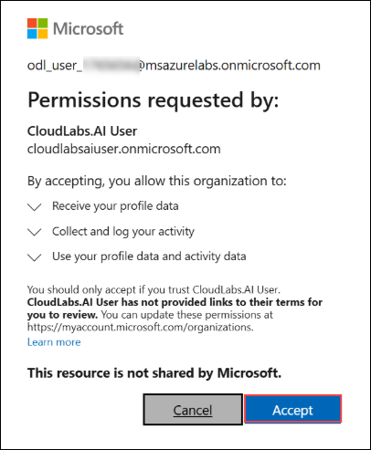

1. On top right of the Github page click this **Icon** then select **Your organizations**.

   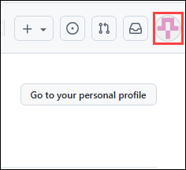

   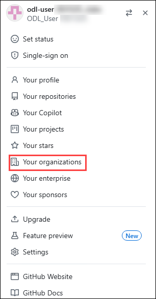

1. You are now successfully logged in to **GitHub** and have been redirected to the **GitHub homepage**.

1. Selcet **New** to create a new repository

   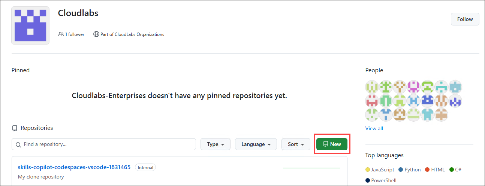

1. Click on the **Copy link** button, then open a new tab in the Edge browser inside the LabVM. Paste the link into the address bar and press Enter. Ensure you're logged into GitHub, as described in the previous steps.

      ```
      https://github.com/new?template_owner=skills&template_name=copilot-codespaces-vscode&owner=%40me&name=skills-copilot-codespaces vscode&description=My+clone+repository&visibility=public
      ```

   <!-- For start course, run in JavaScript:
      'https://github.com/new?' + new URLSearchParams({
        template_owner: 'skills',
        template_name: 'copilot-codespaces-vscode',
        owner: '@me',
        name: 'skills-copilot-codespaces-vscode',
        description: 'My clone repository',
        visibility: 'public',
      }).toString()
   -->

1. On the **Create a new repository** tab, most fields will be pre-filled. Just update the **Owner** to **Cloudlabs-Enterprises** **(1)**, change the **Repository name** **(2)** as provided below to make it unique.

    - Enter your Repository name as:

      ```
      devsecops-<inject key="Deployment-id" enableCopy="false"/>
      ```

      
    - Then click **Create repository** **(3)** to continue

      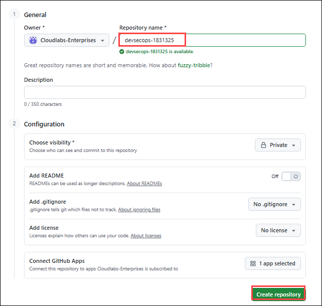

   
   >**Note**: If you observe any repository existing with the same name, please make sure you delete the Repo and create a new one. Please follow steps 15 to 20. Otherwise, skip to step 21.

1. On the overview page search existing repository.

   

1. Select **Settings** in that existing repository.

   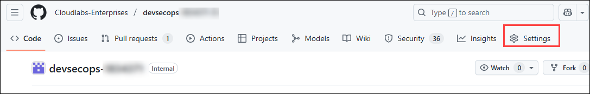

1. In the settings page, scroll to the bottom of the page to select **Delete this repository**, and then click on **I want to delete this repository**.

   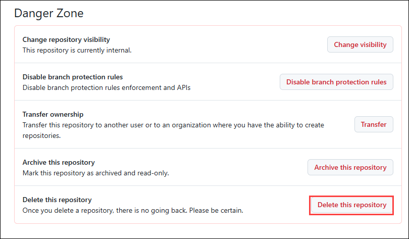

1. Within the following pop-up window, click on **I have read and understand these effects**.

   

1. In the succeeding pop-up window, copy the repository name , paste it in the box, and click on **Delete this repository**.

   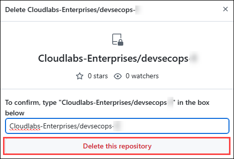

1. On the **Quick setup** screen, copy the **HTTPS** GitHub URL for your new repository and **save it** in a notepad for future use.

   
    
   
1. Navigate back to the **Visual Studio Code** application in which the terminal is already open. In the terminal, click on the **drop-down** button and select **PowerShell** to open a fresh PowerShell terminal tab.

   

   >**Note**: If the terminal is not open by default, please navigate to the terminal and click on new terminal.

1. In Visual Studio Code, run the below commands in the terminal to set your **email** and **username**, which Git uses for commits. Make sure to replace the GitHub account email and username.
   
     ```pwsh
     cd C:\Workspaces\lab\DevOps-DevSecOps-Hackathon-lab-files
     git config --global user.email "you@example.com"
     git config --global user.name "Your UserName"
     ```
     
    
     
    Run the below-mentioned command in the terminal. Make sure to replace `your_github_repository-url` with the value you copied in step 12 and `Unique-ID` in step 13.

    Note: This step is done to initialize the folder as a Git repository, commit, and submit contents to the remote GitHub branch “main” in the lab files repository created in Step 1. 

    Note: Remove the "<>", while entering url and unique id.

      ```pwsh
      git init
      git add .
      git commit -m "Initial commit"
      git branch -M main
      git remote add origin <your_github_repository-url>
      git push -u origin main
      ```
     
   - If you are asked to authenticate your GitHub account, select **Sign in with your browser**, and you will be prompted with a pop-up window to authorize Git Credential Manager. Click on **Authorize git-ecosystem** to provide access.

       .png)

       
       
   - After you are prompted with the message **Authorization Succeeded**, close the tab and continue with the next task.

### Task 2: Deploy Infrastructure


2. To create GitHub secrets, in your GitHub lab files repository, click on the **Settings** tab.

      

 3. Navigate to **Environment** **(1)**, click on **Service Principal Details** **(2)**, and copy the **Subscription ID**, **Tenant ID (Directory ID)**, **Application ID (Client ID)**, and **Secret Key (Client Secret)**.

      
   
      - Replace the values that you copied in the below JSON. You will be using them in this step.
      
         ```json
         {
            "clientId": "zzzzzzzz-zzzz-zzzz-zzzz-zzzzzzzzzzzz",
            "clientSecret": "zzzzzzzzzzzzzzzzzzzzzzzzzzzzzzzzzzzzzzzz",
            "tenantId": "zzzzzzzz-zzzz-zzzz-zzzz-zzzzzzzzzzzz",
            "subscriptionId": "zzzzzzzz-zzzz-zzzz-zzzz-zzzzzzzzzzzz"
         }
         ```

4. Under **Security**, expand **Secrets and variables** **(1)** by clicking the drop-down and select **Actions** **(2)** blade from the left navigation bar. Select the **New repository secret** **(3)** button.

   

5. Under the **Actions Secrets/New secret** page, enter the below-mentioned details and click on **Add secret** **(3)**.

   - **Name** : Enter **SERVICEPRINCIPAL** **(1)**
   - **Value** : Paste the service principal details in JSON format **(2)**
   
      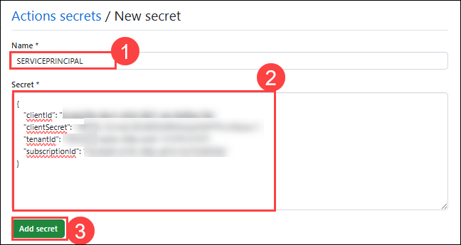

6. To create another secret, under the **Actions Secrets/New secret** page, enter the below-mentioned details and click on **Add secret** **(3)**.

   - **Name**: Enter **SQLPASSWORD** ***(1)***
   - **Value**: You need to enter any unique password with combination of Alphanumeric letters. Your password must contain characters from three of the following categories – English uppercase letters, English lowercase letters, numbers (0-9), and non-alphanumeric characters (!, $, #, %, etc.).

      

7. Under the **Actions Secrets/New variable** page, enter the below-mentioned details and click on **Add variable** ***(3)***.

   - **Name** : Enter **SUFFIX** ***(1)***
   - **Value** : **<inject key="DeploymentID" enableCopy="false" />** (Copy the Deployment ID from the environment details tab) ***(2)***
   
      

8. Same as above create a new variable called **DEPLOYMENTREGION** and enter the region (Example: eastus2) where you want to deploy your infrastructure. 

   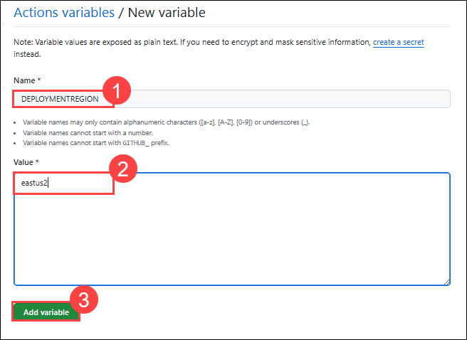


10. To run a workflow, perform the following steps and wait for the resources to be deployed within your Azure Portal:
      - Click on **Actions (1)** within your GitHub repository.
      - Select the workflow named **contoso-traders-provisioning-deployment (2)**.
      - Click on **Run workflow (3)**.
      - Finally, click on **Run workflow (4)**. Ensure that the branch is selected as **main**.

         

         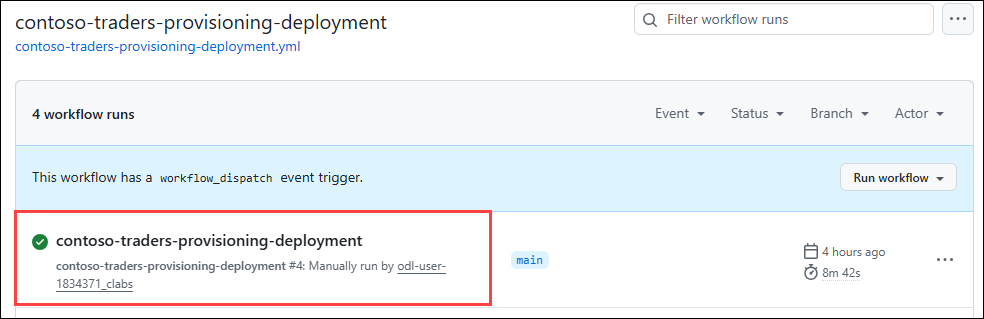

### Task 3: Setup CI/CD Workflow

1. From the Azure Portal Dashboard, click on Resource Groups from the Navigate panel to see the resource groups.

    
   
1. Select the **contosotraders-rg<Deployment-ID>** resource group from the list.

     
   
1. Select the **productsdb** SQL database from the list of resources.

    
   
1. Under the Settings side blade, select **Connection strings** ***(1)*** and copy the **ADO.NET (SQL authentication)** ***(2)*** connection string from the ADO.NET tab. 

     
 
1. In your GitHub lab files repository, select the **Settings** tab from the lab files repository.

   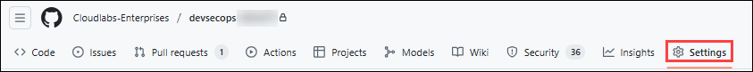
   
1. Under **Security**, expand **Secrets and variables** ***(1)*** by clicking the drop-down and selecting **Actions** ***(2)*** from the left navigation bar. Select the edit button for the created secret named **SQL_PASSWORD** ***(3)***.

   
    
1. Under the **Actions Secrets/Update secret** page, enter the below-mentioned details, and click on **Update secret** ***(3)***.

   - **Value**: Paste the **ADO.NET (SQL authentication)** that you  have copied in the previous step.
   
      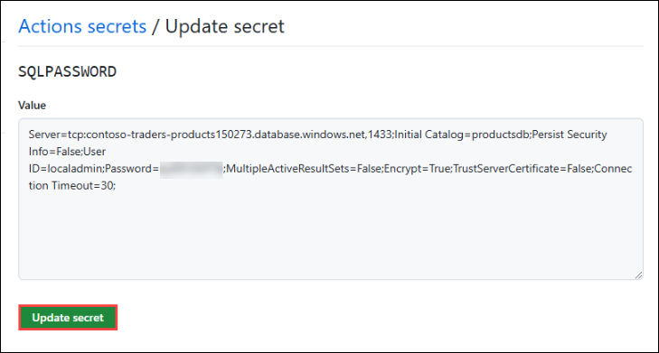
   
   >**Note**: Replace `{your_password}` with the password that you have used initially
   
   
1. From your GitHub repository, select the **Actions** ***(1)*** tab. Select the **contoso-traders-app-deployment** ***(2)*** workflow from the side blade, Click on the  **drop-down** ***(3)*** next Run workflow button, and select **Run workflow** ***(4)***.

   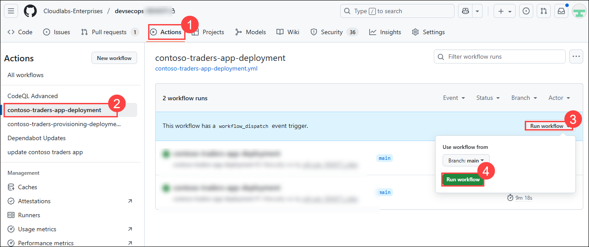
   
1. Navigate back to the Actions tab and select the **contoso-traders-app-deployment** workflow. This workflow builds the Docker image, which is pushed to the container registry. The same image is pushed to the Azure container application.

   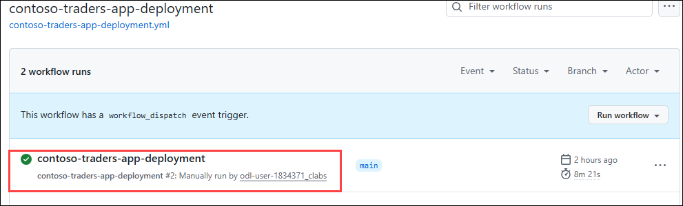
   

   
   **Note**: If the workflow **fails** due to the **npm install** job, follow steps 10 to 12. 
   
1. From the GitHub browser tab, follow the steps given below and click on **Create codespace on main** ***(3)***.

   - Click on **Code** ***(1)***, 
   - Select the **Codespace** ***(2)*** tab

      
   
1. Run the below-mentioned commands in the **Terminal**. You'll set the node version to node 14.

   ```pwsh
   cd src
   cd ContosoTraders.Ui.Website
   nvm install 14
   nvm use 14
   npm i
   git add . 
   git commit -m "updated node version"
   git push
   ```
    
1. From your GitHub repository, select the **Actions** ***(1)*** tab. You'll see an Action named **Updated node version** ***(2)*** executing. Please wait until the execution is complete.

   
   
         

## Task 4: Test the application and perform rolling updates

1. Navigate to Azure Portal, and click on Resource Groups from the Navigate panel to see the resource groups.

    
   
2. Select the **contosotraders-<inject key="DeploymentID" enableCopy="false" />** resource group from the list.

    
   
3. Select the **contoso-traders-cdn<inject key="DeploymentID" enableCopy="false" />** Front Door from the list of resources.

   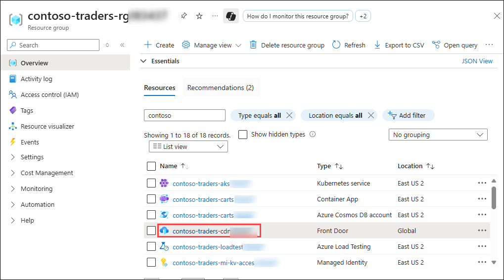 
   
4. Once you opened the Fron Door Just scroll dow under **properties** you can see the **Endpoint hostname** just copy it and paste in new tab.

   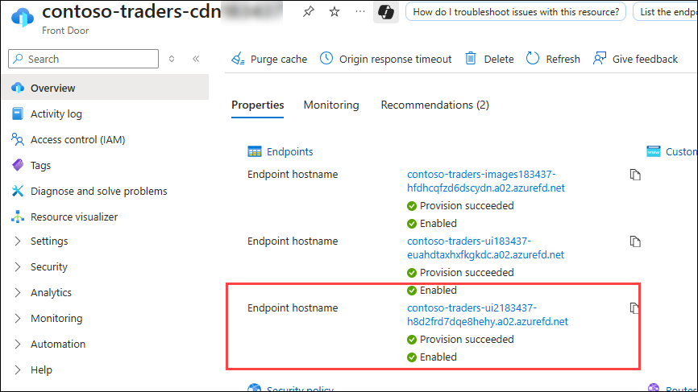 
    
    
    
   The last task automated building and updating only one of the Docker images. In this task, we will update the workflow file with a more appropriate workflow for the structure of our repository. This task will end with    a file named `docker-publish.yml` that will rebuild and publish Docker images as their respective code is updated.

   
## Success criteria:
To complete this challenge successfully:

- The application must be deployed using VS Code, which supports GitHub Actions.
- A new repository must have been created.
- **CI/CD Implementation**: The CI/CD pipeline should be established using GitHub Actions, encompassing build, test, and deployment stages effectively.
- **Deployment Accuracy**: The application must be successfully deployed using GitHub Actions, and the chosen deployment strategy should align with the project's requirements.

## Additional Resources:

- Refer to [GitHub Actions and .NET](https://learn.microsoft.com/en-us/dotnet/devops/github-actions-overview) for reference.
- [Building and testing .NET](https://docs.github.com/en/actions/automating-builds-and-tests/building-and-testing-net).
- [Why CI/CD](https://resources.github.com/ci-cd/).
- [Continuous Deployment with Github Actions: An Example](https://www.dolthub.com/blog/2020-11-23-continous-deployment-with-github-actions/).
- [How to build a CI/CD pipeline with GitHub Actions in four simple steps](https://github.blog/2022-02-02-build-ci-cd-pipeline-github-actions-four-steps/).
