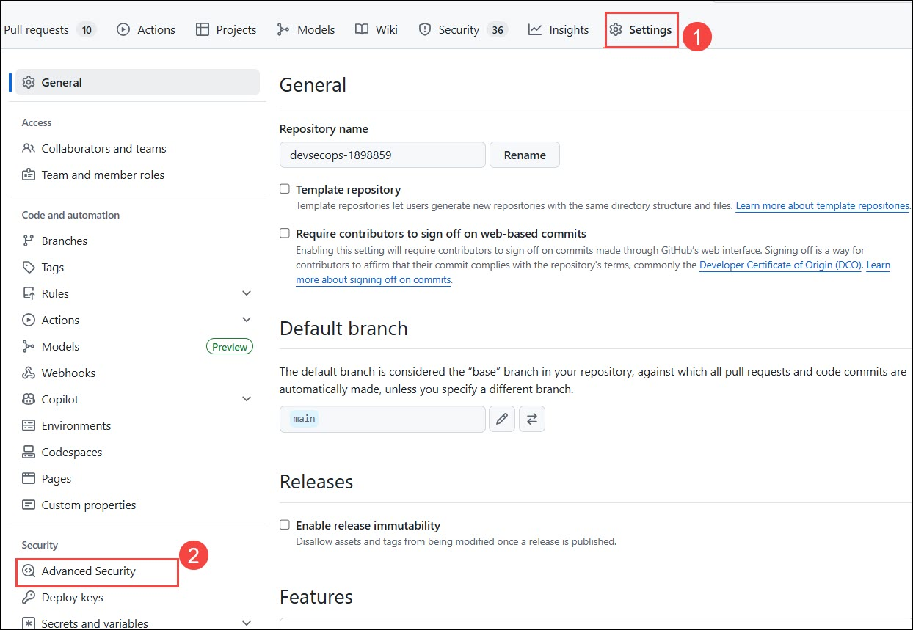

# Challenge 02: GitHub Advanced Security - Implement Code Security Enhancements

## Introduction
In this challenge, the user will focus on implementing security features such as Code scanning, CodeQL alerts, and repository security advisories to their GitHub repository using GitHub Advance security features.

Here's the solution guide, which includes detailed step-by-step instructions required to complete this challenge.

## Accessing GitHub

1. In a new tab, navigate to the **GitHub login** page by copying and pasting the following URL into the address bar:

   ```
   https://github.com/login
   ```

1. On the **Sign in to GitHub** tab, enter the provided **GitHub username** **(1)** in the input field, and click on **Sign in with your identity provider** to continue **(2)**.

    - Email/Username: **odl-user-did_clabs** The Username is similar to this  make sure you have to replace the **did** with your **Deployement ID**. Deployement id you can find in Environment Tab.

      

1. Click on **Continue** on the **Single sign-on to CloudLabs Organizations** page to proceed.

    

1. You'll see the **Sign in** tab. Here, enter your Azure Entra credentials:

   - **Email/Username:** 

       

1. Next, provide your password and click on **Sign in**

   - **Password:** 

      

1. On the **Stay Signed in?** pop-up, click on No.

    

1. On the **Permission requested by** pop-up, click on **Accept**.

      

## Solution Guide

## Task 1: Implement Code Scanning and CodeQL:

In this task, you'll configure Code scanning and explore CodeQL alerts. Code scanning is a feature that you use to analyze the code in a GitHub repository to find security vulnerabilities and coding errors. Any problems identified by the analysis are shown on GitHub.

**Note**: To perform this task, the GitHub repository should be public. If the repository visibility is private, please go to the settings of the repository and change the visibility to public.

   
1. Select the **Settings** **(1)** tab from the GitHub browser tab. Click on **Advance security** ***(2)*** under the security side blade.

     

1. Enable **GitHub Advanced Security** for the repository by clicking on **Enable**.

     

    
   
1. Click on the **Set up** **(1)** button to enable CodeQL analysis, and select the **Advanced** **(2)** option for creating a CodeQL Analysis YAML file.

         

1. Update the workflow name to **codeql-analysis.yml** ***(1)*** and review the yaml file. Select **Commit changes** ***(2)***, then select **Commit directly to the main branch** ***(3)***, and click on **Commit changes** ***(4)***.
  
   

    

1. Navigate to the **Actions** ***(1)*** tab, here you can review the **workflow** ***(2)*** run.
    
    
  
1. Navigate to the **Security** ***(1)*** tab and click on **View alerts** ***(2)***.
   
    
  
1. You will be navigated to the **Code scanning** section. You’ll be able to see the alerts generated from the code scanning.
   
   
    
1. You will be navigated to the **Code scanning** section. You'll be able to visualize the **No code scanning alerts here!**.
   
   
   
 ## Success criteria:
To complete this challenge successfully:

   - Verify the implementation of Implement Code Scanning and CodeQL.
   - Configure the Repository security advisories feature and create temporary private fork.

## Additional Resources:

- Refer to [About GitHub's Advanced Security](https://docs.github.com/en/code-security/getting-started/github-security-features) for reference.
- Refer to [About GitHub's Advanced Security](https://docs.github.com/en/code-security/code-scanning/introduction-to-code-scanning/about-code-scanning-with-codeql) for reference.
- Refer to [Code Scanning with GitHub CodeQL](https://learn.microsoft.com/en-us/training/modules/code-scanning-with-github-codeql/) for reference.
