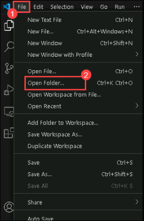
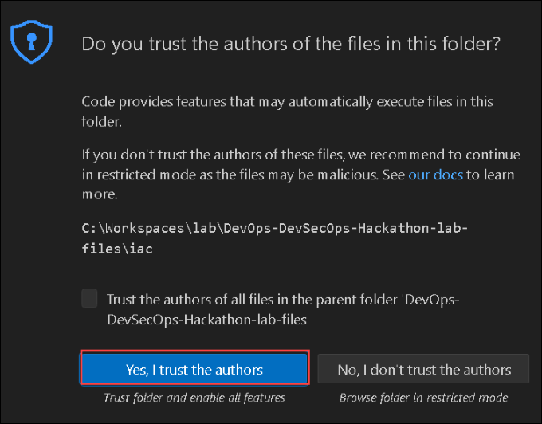
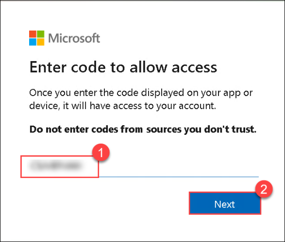
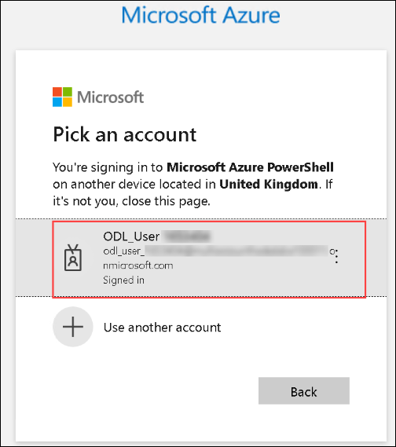
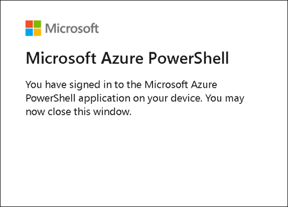
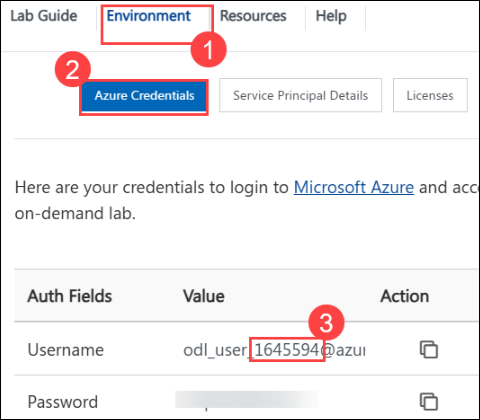
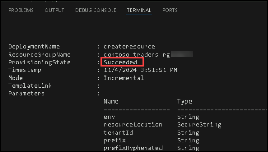

# Challenge 05: Implementing Monitoring Solutions for Contoso Traders

## Introduction

In this challenge, the user/attendee will integrate Azure's monitoring tools—Azure Monitor and Application Insights—into their Azure-based application. Monitoring is vital for maintaining efficiency and resilience in cloud applications, enabling proactive issue identification and seamless user experiences.

This is the solution guide that contains all of the comprehensive, step-by-step directions needed to finish the challenge.

## Solution Guide

### Task 1: Deploy Monitoring Infrastructure

1. You will deploy the complete monitoring infrastructure using the Bicep template named monitoringinfra.bicep. The monitoring infrastructure includes Application Insights, a secret created for Application Insights, and a monitoring dashboard.

1. Open VS Code within the VM, and then click on File (1) at the top left corner and then select Open Folder... (2).

    

1. Navigate to `C:\Workspaces\lab\DevOps-DevSecOps-Hackathon-lab-files\iac` path, open the `monitoringinfra.parameters.json` file and update **env** parameter value with **deployment-ID**.

    

1. Click on Yes, I trust the authors.

   

1. Open the monitoringinfra.parameters.json (1) file. Locate the env parameter in the JSON file and update its value with the deployment ID (2) and then save.

   >**Note**: You can find the deployment ID within the environment details tab of your integrated lab guide.

   

1. In the VS Code Terminal, run the following command to log in to your Azure account:

   ```
   Connect-AzAccount -UseDeviceAuthentication
   ```

1. Connect-AzAccount -UseDeviceAuthentication Go to `https://microsoft.com/devicelogin` **(1)** in the VM browser and copy the **code** **(2)**.

    

1. Paste the Code (1) you copied earlier and click Next (2).

    

1. Choose the account you are using.

    

1. Click on Continue.

    

1. After signing in, return to Visual Studio Code.

   

1. Set the Resource Group Name before running the deployment command. set the $RGname as contoso-traders-rg<DeployementID>

   ```
   $RGname = '<update the RG name mentioned above>'
   ```

   

   >**Note**: For <DeploymentID>, Navigate to Environment (1), click on Azure credentials (2), and copy (3).

   

   >**Note**: Make sure you are in the directory where the Bicep template and parameters file reside. If not, switch to the directory cd C:\Workspaces\lab\DevOps-DevSecOps-Hackathon-lab-files\iac

1. Run the following command to initiate the deployment using the Bicep template and parameters file:

    ```
    New-AzResourceGroupDeployment -Name "createresource" -TemplateFile "monitoringinfra.bicep" -TemplateParameterFile "monitoringinfra.parameters.json" -ResourceGroup $RGname
    ```

1. Monitor the output in the terminal, and wait until the deployment succeeds.

    

### Task 2: Monitoring using Application Insights

1. In the Azure Portal, navigate to the **contoso-traders-rgXXXXXX** **(1)** resource group and select the **Application Insights** resource with the name  **contoso-traders-aiXXXXXX** **(2)**.

   **>Note:** XXXXXX refers to deployement id.

   

1. From the Overview of **contoso-traders-aiXXXXXX** Application Insights resource, you can set the **Show data for last** as per your requirement of monitoring insights.

   

1. In the first graph, you can see the number of failed requests for Application access.

   

1. In the next graph, you can see the average server response time.

   
   
1. In the next graph, you can see the number of server requests.

   

1. In the last graph, you can see the average availability.

     

## Success criteria:

To complete this challenge successfully:

- Successful integration of Azure Monitor and Application Insights within the application environment, ensuring seamless data collection and monitoring capabilities.

- Selection and configuration of key performance metrics relevant to the application's functionality and performance goals.

- Establishment of effective alerting mechanisms with well-defined thresholds, ensuring timely notifications for potential issues or deviations in monitored metrics.

## Additional Resources:

- Refer to [Application Insights Overview](https://learn.microsoft.com/en-us/azure/azure-monitor/app/app-insights-overview) for reference.

- Refer to [Application Insights for ASP.NET Core applications](https://learn.microsoft.com/en-us/azure/azure-monitor/app/asp-net-core?tabs=netcorenew%2Cnetcore6).

- Refer to [Azure Monitor vs. Application Insights](https://azurelib.com/azure-monitor-vs-application-insights/) for reference.
