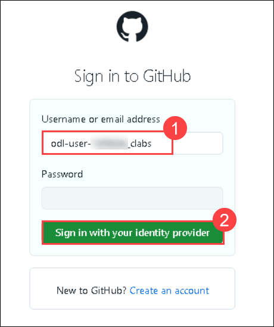
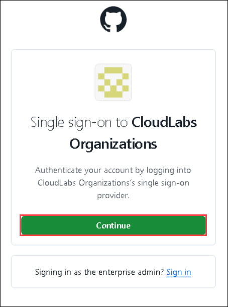
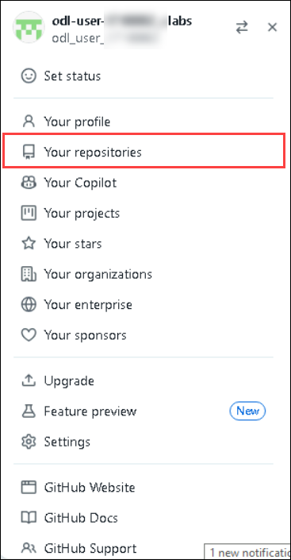
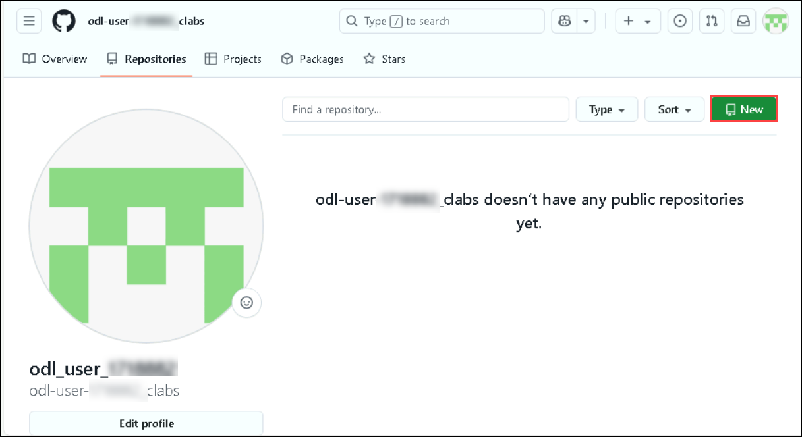
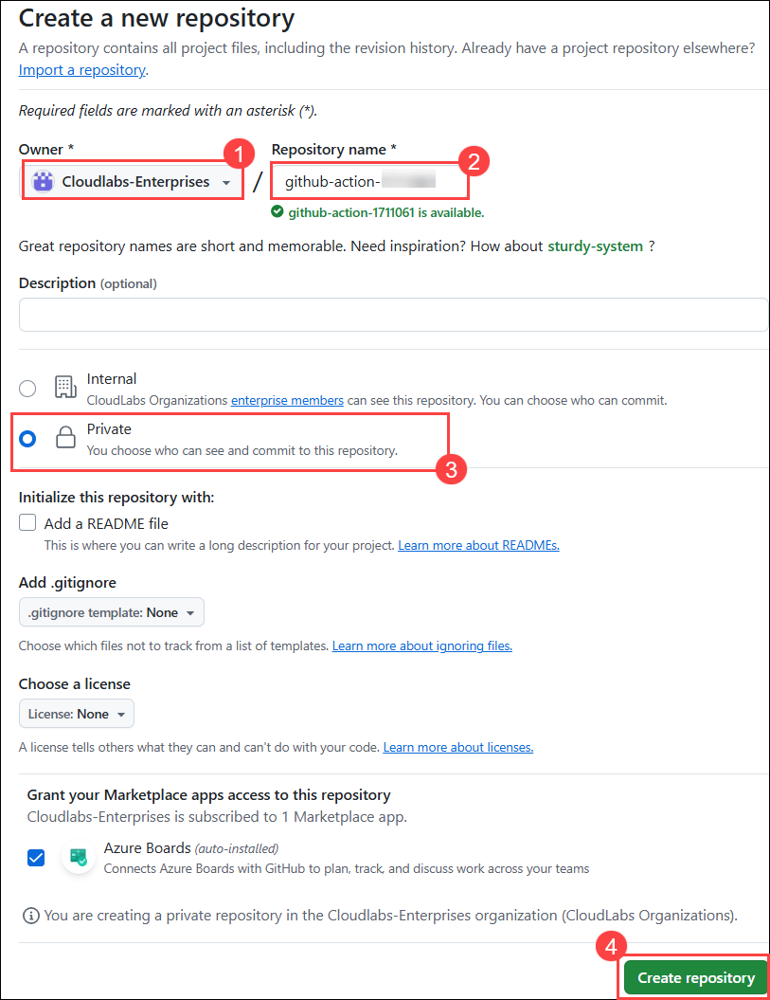

# Challenge 01: Continuous Integration and Deployment for Contoso Traders using GitHub Actions

### Estimated Time: 90 minutes

## Introduction:
This challenge is designed to evaluate your skills in creating a robust CI/CD pipeline leveraging GitHub Actions. It aims to assess your capability to not only establish a seamless pipeline but also to guarantee the successful deployment of the application.

You are a DevOps engineer tasked with setting up a robust Continuous Integration and Continuous Deployment (CI/CD) pipeline for an e-commerce application named Contoso Traders. The goal is to set up a GitHub repository, implement a CI/CD workflow using GitHub Actions, deploy the application to Azure, and make rolling updates to the repository.

## Accessing the Azure Portal

1. To access the Azure Portal, open the Edge browser from inside the environment VM and navigate to ```https://portal.azure.com```.

1. On the **Sign in to Microsoft Azure** tab, you will see a login screen. Enter the following email/username and then click on **Next**. 

   * Email/Username: <inject key="AzureAdUserEmail"></inject>
        
1. Now enter the following password and click on **Sign in**.

   * Password: <inject key="AzureAdUserPassword"></inject>
     
1. If you see the pop-up **Stay Signed in?**, click No.

1. If you see the pop-up **You have free Azure Advisor recommendations!**, close the window to continue the lab.

1. If a **Welcome to Microsoft Azure** pop-up window appears, click **Maybe Later** to skip the tour.

   >**NOTE:** If you don't have the Microsoft Authenticator app installed on your mobile device, select **Download** now and follow the steps.

1. On the Set up your account page, select **Next.**

   

1. Scan the QR code with your phone. On the phone, inside the Authenticator app, select Work or school account, and scan the QR code. Select **Next**.

   

1. On the Keep your account secure page. Enter the code, which is shown on the Authenticator app.

   

1. Once the code is entered. click **Next**

   

1. Select Done on the Success! page.

   

1. If you see the pop-up **Stay Signed in?**, click **No**.

1. If you see the pop-up **You have free Azure Advisor recommendations!**, close the window to continue the lab.

1. If a **Welcome to Microsoft Azure** popup window appears, click **Cancel** to skip the tour.

## Accessing GitHub

1. Open the GitHub login page in a new tab within the same browser window using the provided URL below:

   ```
   https://github.com/login
   ```

1. On the **Sign in to GitHub** tab, you will see the login screen. 

   - Enter your GitHub **Username** **(1)** as:
    
     ```
     odl-user-<inject key="Deployment ID" enableCopy="false"/>_clabs
     ```
    
   - Click on **Sign in with your identity provider** **(2)** to continue.

     

1. Click on **Continue** on the **Single sign-on to CloudLabs Organizations** page to proceed.

   

1. You are now successfully logged in to GitHub.

1. Click on **Github profile icon** on the top right corner and choose **Your Repositories** from the menu.

   

1. Click on **New**
  
   
   
1. Follow the steps below to create a new repository:
   
    - Select **Cloudlabs Enterprises(1)** as the owner.
    - Enter the **Repository name (2)** as below:
    
      ```
      devsecops-<inject key="Deployment ID"enableCopy="false"/>
      ```
    - Set the  repository visibility to **Private(3)**, 
 
    - Click on **Create repository (4)**.

      

## Challenge Objectives:

>**Note:** Only use GitHub and GitHub Actions for CI/CD; no usage of Azure DevOps or any external CI/CD services.

1. **Setup a GitHub repository:**
   - Create a new GitHub repository in organization.
     
   <validation step="5b252fb5-a2f0-4c4c-8b1d-af806a115039" />
      
      - You are provided with an e-commerce application named Contoso Traders, which needs to be deployed and hosted on Azure.
      - You can navigate to the `C:\Workspaces\lab\DevOps-DevSecOps-Hackathon-lab-files` directory and find the complete code base of the application.
      - Using Visual Studio Code, connect to the GitHub repository that you created in the earlier step and push the application code base to your GitHub repository.
      
      <validation step="d239841d-b8fe-43cb-8170-54bf67f11c8c" />

2. **Deploy Infrastructure:**
   - In the GitHub repository, navigate to the settings and add GitHub action secret and variable as below.
     - Create GitHub secrets with the same name as mentioned below.
        - **SERVICEPRINCIPAL**: Create a secret to store service principal details. You can find the details in the Environment details tab of your environment.
          - Below is the format that you need to use to create the secret for SPN, replace the values that you copied in the below JSON. 
      
            ```json
            {
               "clientId": "zzzzzzzz-zzzz-zzzz-zzzz-zzzzzzzzzzzz",
               "clientSecret": "zzzzzzzzzzzzzzzzzzzzzzzzzzzzzzzzzzzzzzzz",
               "tenantId": "zzzzzzzz-zzzz-zzzz-zzzz-zzzzzzzzzzzz",
               "subscriptionId": "zzzzzzzz-zzzz-zzzz-zzzz-zzzzzzzzzzzz"
            }
            ```
         
        - **SQLPASSWORD**: You need to enter any unique password with a combination of Alphanumeric letters. Your password must contain characters from three of the following categories – English uppercase letters, English lowercase letters, numbers (0-9), and non-alphanumeric characters (!, $, #, %, etc.).
     
     - Create GitHub variables with the same name as mentioned below.   
        - **DEPLOYMENTREGION**: Add the deployment region where you want to get the resources deployed. preferenced **eastus2,uksouth,australiaeast**
      
        - **SUFFIX**: Create a variables to store the deployment ID which is **<inject key="Deployment ID" enableCopy="false" />**.
       
       >**Hint**: You can also find the deployment ID and the Azure AD password within the environment details tab of your integrated lab guide.
 
   -  Run the workflow named `contoso-traders-provisioning-deployment` using GitHub Actions.
      
3. **Setup CI/CD Workflow:**

   - Update the previously created GitHub secret with the following value:
      - **SQLPASSWORD**: ADO.NET (SQL authentication) connection string of `productsdb` SQL database.

   - In the GitHub repository, navigate to  **.github/workflow** where you will be able to find the yaml workflow **contoso-traders-app-deployment**. Run the workflow, this workflow should deploy the application to Azure. 
  
4. **Test the application and perform rolling updates:**
   - Navigate to the Azure Portal and check the application status using Azure Endpoint.
   - Update the workflow file to initiate an Action run on changes to the GitHub repository.
  
## Success criteria:
To complete this challenge successfully:

- Verify the successful deployment of the Infrastructure of application in the Azure Portal.
- Verify the GitHub Action; all the jobs in the GitHub Action should be completed without any errors.
- Verify the deployment and hosting of the Contoso Traders application in Azure.

## Additional Resources:

Here are a few documents and guides to assist you in completing the challenge.
- [GitHub Actions](https://docs.github.com/en/actions)
- [Azure Login](https://github.com/marketplace/actions/azure-login)
- [Why CI/CD](https://resources.github.com/ci-cd/).
- [Continuous Deployment with Github Actions: An Example](https://www.dolthub.com/blog/2020-11-23-continous-deployment-with-github-actions/).
- [How to build a CI/CD pipeline with GitHub Actions in four simple steps](https://github.blog/2022-02-02-build-ci-cd-pipeline-github-actions-four-steps/).


## Conclusion:
Congratulations on completing the **Continuous Integration and Deployment for Contoso Traders using GitHub Actions** challenge. You have successfully verified the configuration of a GitHub repository, established a functional CI/CD workflow, and utilized GitHub Actions to deploy the .NET application. In the next challenge, you will look into implementing security features offered by GitHub.
